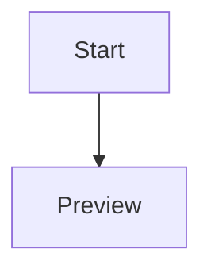
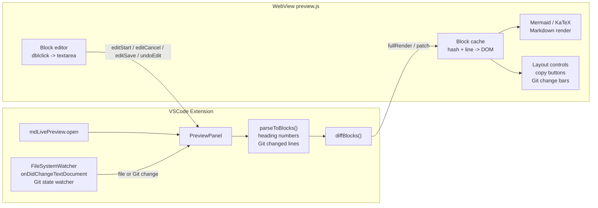

# Markdown Live Preview (LLM-aware)

LLMがファイルを書き換えても **チラつかない** Markdownプレビュー。Mermaid・KaTeX・テーブル対応。


## なぜこの拡張?

LLM(Claude / ChatGPT / Cursor など)に Markdown を生成・編集させていると、ファイルが頻繁に上書きされます。VSCode 標準のプレビューは更新のたびに全体を再描画するため、

- Mermaid 図がチラつく
- スクロール位置が飛ぶ
- 大きい文書で重い

この拡張は **ブロック単位で差分検知** し、変わった箇所だけを更新します。Mermaid 図はキャッシュされ、未変更なら再描画されません。

## 主な機能

- 🔄 **LLM 書き込みの自動検知** — VSCode `FileSystemWatcher` で外部からのファイル更新を即座に反映
- ⚡ **差分レンダリング** — ブロック単位 MD5 ハッシュで変更箇所だけパッチ適用、スクロール位置を維持
- 📊 **Mermaid 対応** — フローチャート・シーケンス図など。テーマ切替可能
- ➗ **KaTeX 数式** — インライン `$...$` とブロック `$$...$$`
- 📋 **GFM テーブル** — 標準対応
- 🔢 **見出し番号の自動表示** — `#` / `##` / `###` などの見出しに `1. ` / `1.1. ` / `1.1.1. ` 形式の番号をプレビュー上で表示
- ✏️ **ブロック単位の編集** — プレビューをダブルクリックで textarea に切替、`Ctrl+Enter` で保存。編集中に別ブロックをクリックすると、変更があれば保存して移動、変更がなければそのまま移動
- 🔒 **編集中ロック** — ユーザー編集中は LLM の更新で上書きされないよう自動ロック

## インストール

### Marketplace から (公開後)

VSCode の拡張機能ビュー (`Cmd/Ctrl+Shift+X`) で `Markdown Live Preview` を検索してインストール、または:

```bash
code --install-extension kooooochi.md-live-preview
```

### 手動インストール (ソースからビルド)

Marketplace に未公開、またはローカルで最新版を試したい場合:

```bash
# 1. リポジトリを取得
git clone https://github.com/kooooochi/md-live-preview.git
cd md-live-preview

# 2. 依存をインストールしてビルド
npm install
npm run compile

# 3. .vsix パッケージを生成
npx vsce package
# → md-live-preview-0.1.0.vsix が生成される

# 4. VSCode にインストール
code --install-extension md-live-preview-0.1.0.vsix
```

インストール後、VSCode を再起動すれば有効になります。

#### GUI からインストールする場合

`.vsix` ファイルを生成した後:

1. 拡張機能ビューを開く (`Cmd/Ctrl+Shift+X`)
2. 右上の `…` メニュー → **VSIXからのインストール**
3. 生成された `md-live-preview-0.1.0.vsix` を選択

#### アンインストール

または拡張機能ビューから歯車アイコン → アンインストール。

#### 開発モードで試す (インストールしない)

ソースを変更しながら試す場合は VSCode で本リポジトリを開き、`F5` で Extension Development Host を起動してください。`.vscode/launch.json` が用意されているので、押すだけで `test.md` を開いた状態の検証ウィンドウが立ち上がります。

## 使い方

### プレビューを開く

1. VSCode で `.md` ファイルを開きます
2. コマンドパレット (`Cmd/Ctrl+Shift+P`) から `Markdown Live: Open Live Preview` を実行します
3. エディタの横にライブプレビューが開きます

Markdown エディタ右上のプレビューアイコンからも開けます。同じファイルのプレビューをもう一度開いた場合は、既存のプレビューが表示されます。

プレビュー左上にマウスを重ねると、横幅切替ボタンが表示されます。`Fit` はウィンドウ幅に合わせて表示し、`Default` は既定の本文幅に戻します。

### プレビュー上で編集する

プレビュー上のブロックをダブルクリックすると、そのブロックだけを直接編集できます。

- `Ctrl+Enter` / `Cmd+Enter`: 編集内容を保存
- `Esc`: 編集をキャンセル
- `Ctrl+Z` / `Cmd+Z`: プレビュー上で保存した直前の編集を取り消し
- `Save` ボタン: 編集内容を保存
- `Cancel` ボタン: 編集をキャンセル

編集中に別のブロックをクリックすると、現在のブロックに変更がある場合は保存してから移動します。変更がない場合は保存せず、そのままクリックしたブロックへ移動します。

### 自動更新

Markdown ファイルを VSCode 上で編集した場合も、LLM や外部ツールがファイルを書き換えた場合も、プレビューは自動で更新されます。更新はブロック単位で反映されるため、未変更の Mermaid 図や数式はできるだけ再描画されません。

プレビュー上でブロックを編集中の場合、編集中のブロックは保護されます。それ以外のブロックに入った変更は、編集を続けたままリアルタイムに反映されます。編集中にファイルへ変更が入った場合は、編集バーに `!` アイコンが表示されます。

### Git 差分の表示

Git 管理下の Markdown ファイルでは、HEAD から変更されている行を含むブロックの左側にバーが表示されます。VSCode の gutter と同じように、未コミットの変更がどのブロックに含まれているかをプレビュー上で確認できます。

### 見出し番号の表示

プレビューでは `#` / `##` / `###` などの見出しに階層番号が自動で表示されます。番号は `1. ` / `1.1. ` / `1.1.1. ` のように、末尾にドットと半角スペースを付けた形式です。Markdown ファイル自体は書き換えません。

### コードブロックのコピー

コードブロックにマウスを重ねると、右上に `Copy` ボタンが表示されます。クリックするとコードブロックの内容だけをクリップボードにコピーできます。

### Mermaid・KaTeX を使う

Mermaid は fenced code block として記述します。

````markdown

````

KaTeX のブロック数式は `$$` で囲みます。インライン数式は `$...$` で書けます。

```markdown
$$
E = mc^2
$$

インライン数式: $a^2 + b^2 = c^2$
```

## 設定

| 設定キー | 既定値 | 説明 |
|---------|--------|------|
| `mdLivePreview.mermaidTheme` | `default` | Mermaid のテーマ (`default` / `dark` / `forest` / `neutral`) |
| `mdLivePreview.enableEdit` | `true` | プレビュー上のダブルクリック編集を有効にする |

## 技術スタック

- **TypeScript** + VSCode Extension API
- **markdown-it** — パーサー (GFM テーブル対応)
- **mermaid.js** — 図のレンダリング
- **KaTeX** — 数式
- **WebView** + Content Security Policy

### アーキテクチャ



## 開発

ソースを変更して試す場合:

```bash

npm install
npm run watch    # ファイル変更を監視してビルド

```

VSCode で本リポジトリを開き、`F5` で Extension Development Host を起動。`src/` を編集して `Cmd/Ctrl+R` で開発ホストをリロードすれば変更が反映されます。

ビルド単体は `npm run compile`、`.vsix` 生成は `npm run package` です。

## ライセンス

MIT — [LICENSE](LICENSE) を参照

## 貢献

Issue / PR 歓迎です。
[GitHub](https://github.com/kooooochi/md-live-preview)
