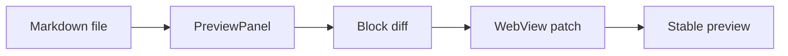
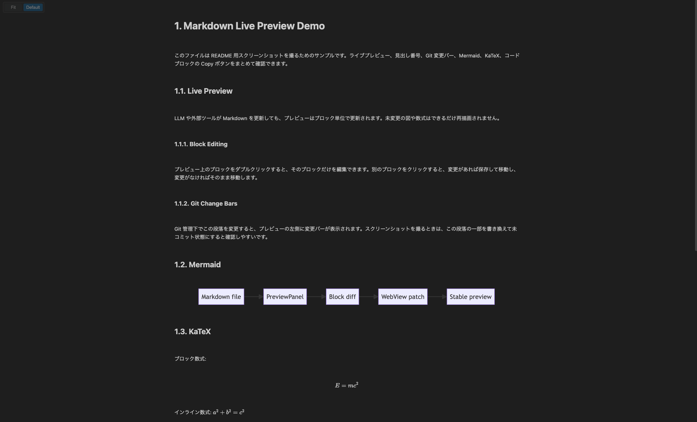

# Markdown Sync Editor Demo

このファイルは README 用スクリーンショットを撮るためのサンプルです。ライブプレビュー、見出し番号、Git 変更バー、Mermaid、KaTeX、コードブロックの Copy ボタンをまとめて確認できます。

## Live Preview

LLM や外部ツールが Markdown を更新しても、プレビューはブロック単位で更新されます。未変更の図や数式はできるだけ再描画されません。

### Block Editing

プレビュー上のブロックをダブルクリックすると、そのブロックだけを編集できます。別のブロックをクリックすると、変更があれば保存して移動し、変更がなければそのまま移動します。

### Git Change Bars

Git 管理下でこの段落を変更すると、プレビューの左側に変更バーが表示されます。スクリーンショットを撮るときは、この段落の一部を書き換えて未コミット状態にすると確認しやすいです。

## Mermaid



## KaTeX

ブロック数式:

$$
E = mc^2
$$

インライン数式: $a^2 + b^2 = c^2$

## Image

Markdown の画像記法でローカル画像を表示できます。



## Code Block

コードブロックにマウスを重ねると、右上に Copy ボタンが表示されます。

```bash
npm install
npm run compile
./install-extension.sh
```

```ts
type Block = {
  hash: string;
  raw: string;
  html: string;
};
```

## Table

| Feature | Preview behavior |
|---------|------------------|
| Heading numbers | Displayed automatically |
| Git changes | Shown with left bars |
| Code blocks | Copy button on hover |
| Mermaid | Rendered in the preview |
